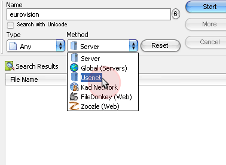
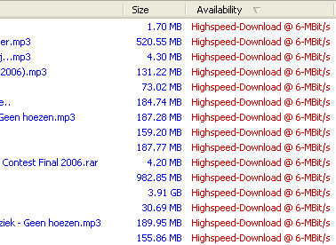

# eMule-NG 0.47a (source code mirror)

## About this project

This is the source code of an eMule advertising mod which was reclaimed quite a bit on eDonkey servers several years ago, but now completely disappeared.
The only new feature about this client is the ability to look for files on Zoozle (now defunct) and Usenet using the integrated search engine and then open the UseNeXT client in order to download the file, after activating this service trial or paying a subscription fee.
The only interesting thing about this client is to see how this and other bad mods were able to implement such a search engine.

The latest version of eMule-NG is the 0.48a, but no source code is available for that release, although I think the modifications apported are version-independent.

***I ([subwave07](https://github.com/subwave07)) am neither one of the developers nor I have contibuited to this project in any way. All the credits go to the original developers.***

The following is an extract of several informations that were available on the official home page ([http://www.emule-ng.com](http://www.emule-ng.com)). Most of the parts were omitted due to the
advertising content not relevant. You can consult the original home page through [archive.org](https://web.archive.org/web/*/http://www.emule-ng.com/).

## The speed of NewsGroups is coming to eMule

eMule-NG is based on the latest version of eMule, the best P2P sotfware nowadays.

**This improved version of eMule allows you to do searches on eDonkey/eMule network as well as on the NewsGroups.** For example, you would spend about 10 hours on eMule, if everything goes fine, to download a 700 MB file. With NewsGroups you make it in 25 minutes!

##The advantages of NewsGroups

* **Continuous and anonymous download to a maximal speed**
* **As easy to use as eMule**
* **800 TB of files, 5000 GB more each day!**

## Previews

&nbsp;&nbsp;

## License

This project is licensed under the GNU General Public License v2